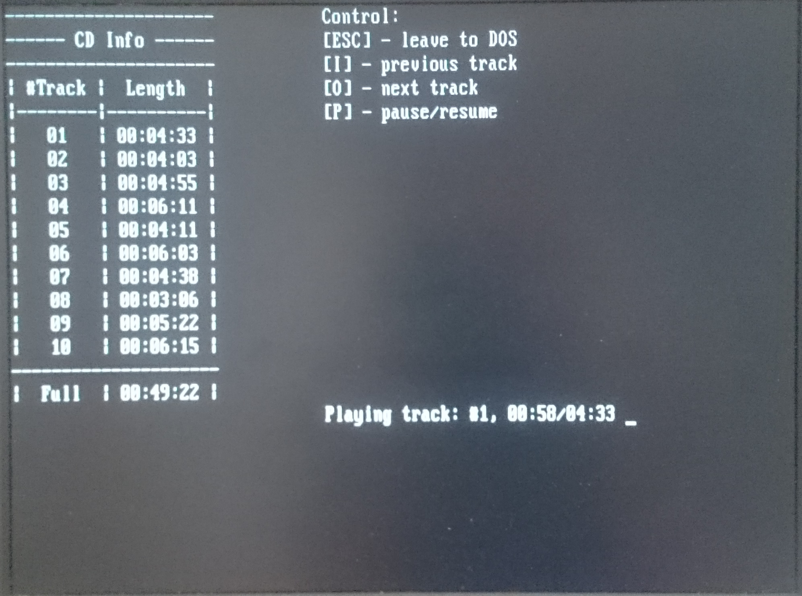

# CDWSS - Audio CD playback on Windows Sound System compatible soundcard for DOS

Small program written just for fun for old 386 computer I once found in dumpster. 
The program plays CD Audio disc via the digital ATA interface, rather than "the usual DOS way", using additional analog connection between CD-ROM and sound card.
Why? Beacuse I hadn't found player with such functionality and I had way too much time sitting locked at home due to coronavirus pandemic...

Program supports Windows Sound System compatible soundcards only. WSS standard is easily capable of playing CD Audio quality sound, also WSS-compatible 
soundcards are much cheaper and easier to buy than Sound Blaster 16 - the only alternative for the task. 

### Features

- Audio CD playback via ATA interface
- Skipping tracks
- Pausing (needs some fixes, described in MAIN.C)
- Showing disc TOC
- Showing track number and playtime
- Written in Borland C++ 2.0
- Requires Windows Sound System (WSS) compatible soundcard (tested on some cheap OEM Yamaha YMF719-S card)
- Soundcard settings are hardcoded to BASE 0x530, IRQ 5, DMA 1 (WSS.H)